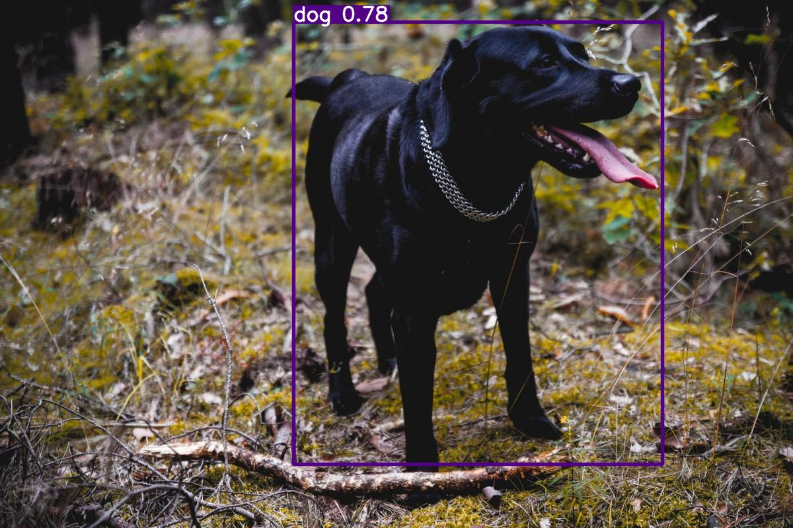
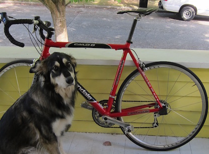
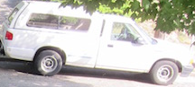
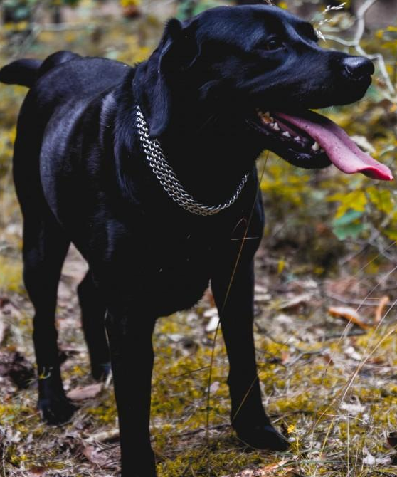

# Object Detection and Image Cropping Project
This project focuses on performing object detection using a pretrained YOLOv5s model. Following the detection, the script crops the original image based on the model's outputs, isolating the predicted objects.

# Test Flag:
For testing code, there should be a function named test(). When calling the test() function without specifying an image path, it will display an image both before and after cropping, along with the detection of an object. This implies selecting any image from the testing dataset.
Terminal Command : python main.py --test True

However, if an image path is provided when calling the test() function (like test("image_path")), it will display the original image, the image after cropping, and provide information such as the label and score for the detected object in the terminal.

Moreover, if an image URI or URL is supplied to the test() function, it will download the image, save it as a JPEG file, and then display the original and cropped versions. Additionally, it will show the label and score for the detected object.

## Usage
Run the main.py script to execute supporting scripts that perform object detection, cropping and create two folders:

- runs folder: Contains labeled images with predicted bounding boxes.

- Cropped_images folder: Contains images of the predicted objects cropped from the original image.

## Orignal sample

## Predicted Sample

## Cropped samples

  
  
  

